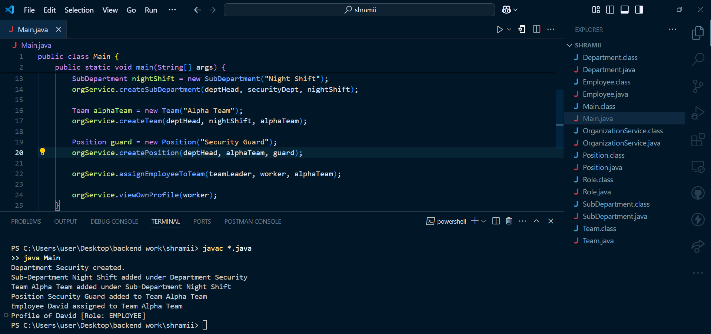

# Organization Hierarchy Management - Java Project

This project is a basic **Organization Hierarchy Management** system built in pure **Java** without any database dependency.

It allows you to:
- Create Departments, Sub-departments, Teams, and Positions
- Assign Employees to different levels
- Implement Role-Based Access Control


## Project Structure

```
OrganizationApp/
├── Department.java
├── SubDepartment.java
├── Team.java
├── Position.java
├── Employee.java
├── Role.java
├── OrganizationService.java
└── Main.java
```


## Features

- **Employer**: Full access to create and manage Departments, Sub-Departments, Teams, and Positions.
- **Department Head**: Manage Sub-Departments, Teams, and Positions inside their Department.
- **Sub-Department Head**: Manage Teams and Positions within their Sub-Department.
- **Team Leader**: Manage employees inside their Team.
- **Employee**: Can view their own profile only.


## How to Run

### 1. Requirements
- Java JDK 17 or higher
- VS Code with "Extension Pack for Java" installed


### 2. Steps
1. Clone or download this project.
2. Open the folder in VS Code.
3. Compile and run:
   - Right-click `Main.java` and select **Run Java**
   OR
   - Use the terminal:

```bash
javac *.java
java Main
```

4. You should see the organization hierarchy being created in the console output.

